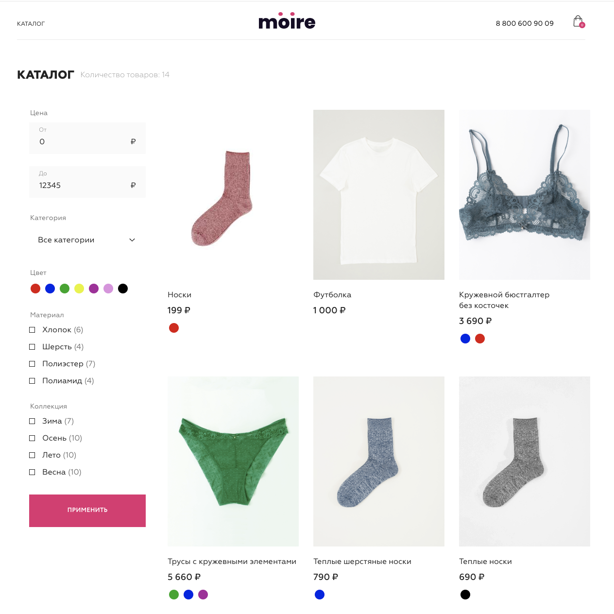
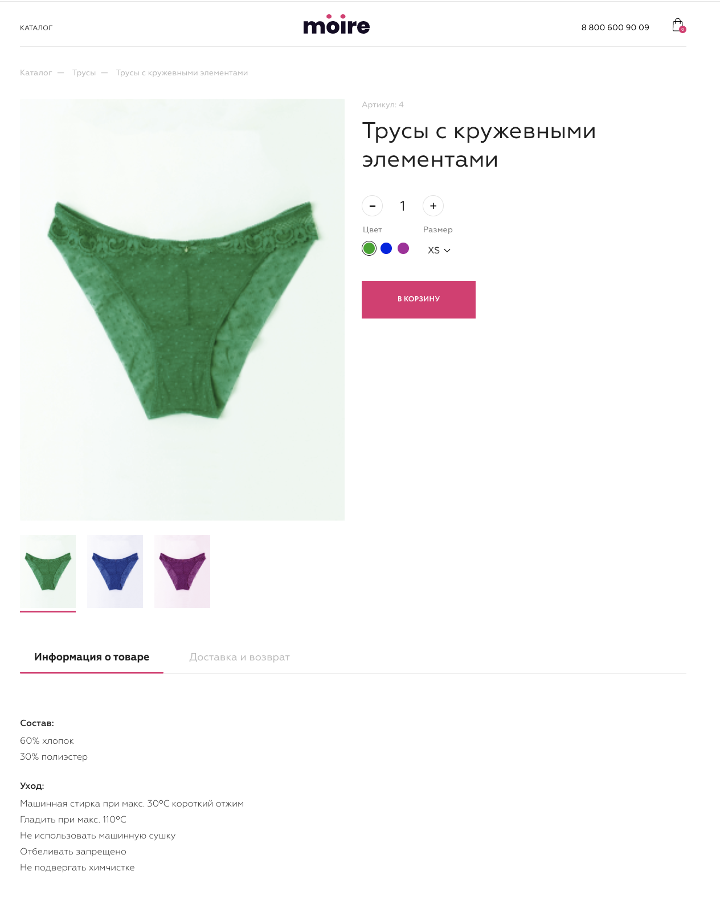
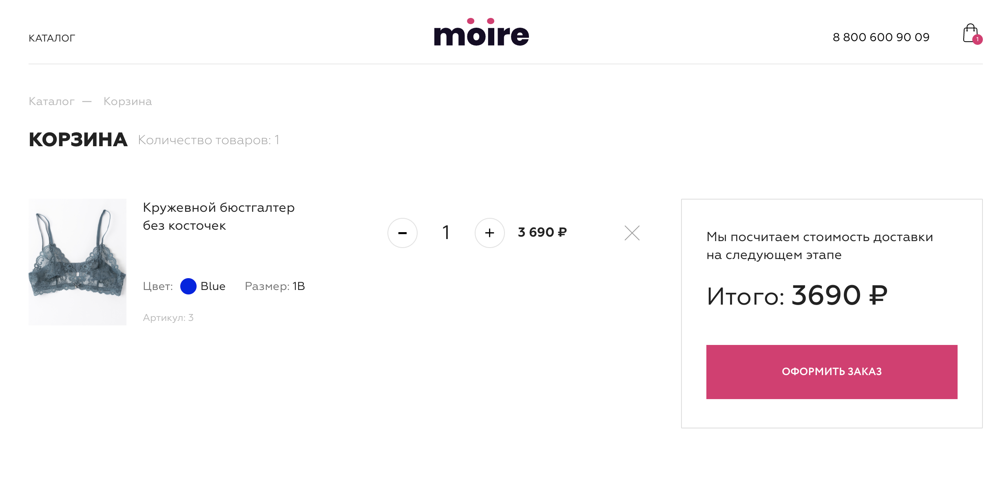

### Интернет-магазин премиального белья Moire на Vue.js с использованием REST API

##  Техническое задание
1. Описание поведения.
Пользователь может выполнить на сайте следующие действия:
- Посмотреть список товаров по страницам;
- Отфильтровать список товаров по параметрам;
- Посмотреть информацию о товаре на его детальной странице;
- Добавить товар с выбранным цветом и размером в корзину;
- Изменить количество товаров в корзине;
- Удалить товары из корзины;
- Внести данные на странице оформления заказа;
- Выбрать способ доставки и оплаты;
- Оформить заказ и посмотреть информацию о нём на странице успешного оформления заказа;

2. Состав продукта.
Сайт должен содержать в себе следующие разделы:
- Список товаров;
- Страница товара;
- Корзина;
- Оформление заказа;
- Успешное оформление заказа.






## Project setup
```
npm install
```

### Compiles and hot-reloads for development
```
npm run serve
```

### Compiles and minifies for production
```
npm run build
```

### Lints and fixes files
```
npm run lint
```